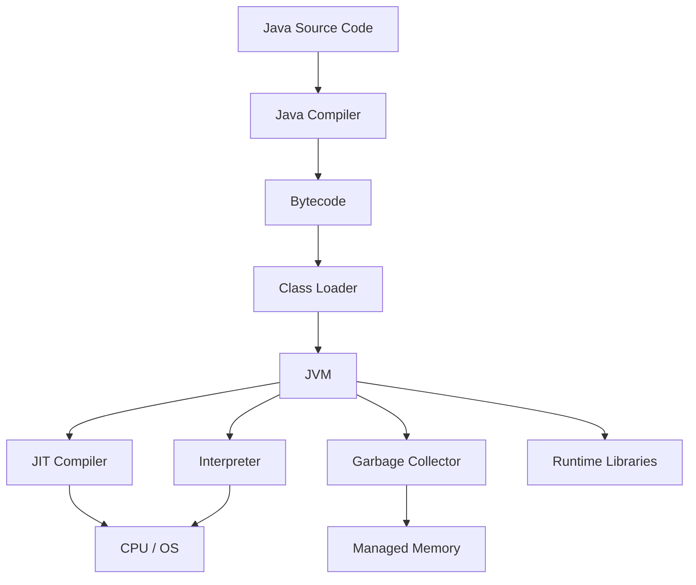
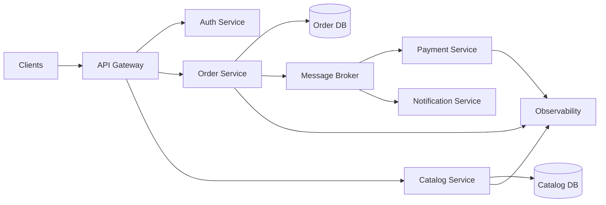

# Java Programming

## Java Programming — From Fundamentals to Advanced Software Engineering

<p align="center">
  
</p>

<h1 align="center">Java Mastery</h1>

<p align="center">
  <strong>A modern, academic, research-oriented and hands-on roadmap for learning Java from absolute fundamentals to advanced software engineering.</strong>
</p>

<p align="center">
  <a href="https://www.oracle.com/java/"></a>
  <a href="https://dev.java/"></a>
  <a href="https://docs.oracle.com/en/java/"></a>
  <a href="https://openjdk.org/"></a>
  
  
  
  
  
</p>

---

# 👨‍💻 About Me

Hi, I'm **Satinder Singh Sall**, a Full-Stack Developer, AI Enthusiast, and MCA student passionate about building scalable digital products, intelligent software systems, and meaningful user experiences.

My journey spans across **Web Development, Mobile Applications, Artificial Intelligence, Cloud Technologies, and Creative Writing**. I enjoy transforming ideas into production-ready solutions using modern technologies while continuously exploring emerging fields like Machine Learning, Computer Vision, and Automation.

Currently, I'm pursuing my **Master of Computer Applications (MCA)** while actively developing full-stack applications, AI-powered solutions, and open-source learning resources. My work focuses on creating software that is not only functional but also scalable, maintainable, and impactful.

## 🚀 What I'm Building

- 🤖 AI-Powered Attendance System using Face Recognition & Voice Biometrics
- 🌐 Modern Full-Stack Web Applications
- 📱 Cross-Platform Mobile Applications
- 🎮 Exploring Game Development & Interactive Experiences
- 📚 Open-Source Learning Roadmaps and Technical Resources
- ✍️ Satinder Poetry — A platform for original poetry, essays, and creative writing

## 🛠️ Core Technologies

**Frontend:** React, Next.js, TypeScript, Tailwind CSS
**Backend:** Node.js, Express.js, REST APIs
**Databases:** MongoDB, PostgreSQL, MySQL, Firebase, Supabase
**DevOps & Cloud:** Docker, GitHub Actions, Vercel, Render
**Programming:** Python, Java, JavaScript, C++, C#, Kotlin
**AI / ML:** Python, Computer Vision, Face Recognition, Automation
**Mobile Apps:** High-Performance Android, iOS, Cross-Platform & Native Development

## 🌍 Connect With Me

🌐 Portfolio: https://satinder-portfolio.vercel.app

💻 GitHub: https://github.com/SatinderSinghSall

💼 LinkedIn: https://www.linkedin.com/in/satinder-singh-sall-b62049204/

🎥 YouTube: https://www.youtube.com/@satindersinghsall.3841

✍️ Satinder Poetry: https://satinderpoetry.com

🤖 AI Attendance Project: https://ai-attendance-app-satinder.vercel.app/

---

> _"I believe great software is built at the intersection of engineering excellence, continuous learning, creativity, and real-world problem solving."_

⭐ Always learning. Always building. Always improving.

---

## Abstract

Java is a general-purpose programming language and runtime ecosystem used across backend systems, enterprise software, distributed systems, cloud services, developer tooling, data platforms, and high-throughput applications.

This repository is a complete Java learning and engineering curriculum. It progresses from syntax and programming fundamentals through object-oriented design, collections, generics, functional programming, concurrency, JVM internals, testing, build systems, networking, databases, Spring, REST APIs, microservices, security, performance engineering, observability, and distributed-system architecture.

The objective is not merely to memorize Java syntax. The objective is to learn how to reason about programs, design maintainable abstractions, understand JVM behavior, write concurrent software safely, test and benchmark systems scientifically, and build production-grade applications.

> **Learning philosophy:** Understand → Implement → Test → Measure → Refactor → Explain → Design.

---

# Table of Contents

- [1. Learning Outcomes](#1-learning-outcomes)
- [2. Prerequisites](#2-prerequisites)
- [3. Java at a Glance](#3-java-at-a-glance)
- [4. Java Platform Mental Model](#4-java-platform-mental-model)
- [5. Java Architecture](#5-java-architecture)
- [6. Complete 20-Topic Roadmap](#6-complete-20-topic-roadmap)
- [7. Topic 01 — Java Fundamentals](#topic-01--java-fundamentals)
- [8. Topic 02 — Development Environment and Tooling](#topic-02--development-environment-and-tooling)
- [9. Topic 03 — Object-Oriented Programming](#topic-03--object-oriented-programming)
- [10. Topic 04 — Arrays, Strings and Memory](#topic-04--arrays-strings-and-memory)
- [11. Topic 05 — Exception Handling](#topic-05--exception-handling)
- [12. Topic 06 — Collections Framework](#topic-06--collections-framework)
- [13. Topic 07 — Generics](#topic-07--generics)
- [14. Topic 08 — Functional Java](#topic-08--functional-java)
- [15. Topic 09 — Streams and Modern Java](#topic-09--streams-and-modern-java)
- [16. Topic 10 — Date, Time, I/O and Serialization](#topic-10--date-time-io-and-serialization)
- [17. Topic 11 — Multithreading and Concurrency](#topic-11--multithreading-and-concurrency)
- [18. Topic 12 — JVM Internals](#topic-12--jvm-internals)
- [19. Topic 13 — Testing and Code Quality](#topic-13--testing-and-code-quality)
- [20. Topic 14 — Build Tools and Dependency Management](#topic-14--build-tools-and-dependency-management)
- [21. Topic 15 — Networking and Database Programming](#topic-15--networking-and-database-programming)
- [22. Topic 16 — Spring and Enterprise Java](#topic-16--spring-and-enterprise-java)
- [23. Topic 17 — REST APIs and Microservices](#topic-17--rest-apis-and-microservices)
- [24. Topic 18 — Security and Secure Coding](#topic-18--security-and-secure-coding)
- [25. Topic 19 — Performance Engineering and Observability](#topic-19--performance-engineering-and-observability)
- [26. Topic 20 — Advanced Architecture and Distributed Systems](#topic-20--advanced-architecture-and-distributed-systems)
- [27. Core Java Syntax Reference](#27-core-java-syntax-reference)
- [28. Object-Oriented Design Principles](#28-object-oriented-design-principles)
- [29. Data Structures and Algorithms in Java](#29-data-structures-and-algorithms-in-java)
- [30. Concurrency Reference](#30-concurrency-reference)
- [31. JVM and Garbage Collection](#31-jvm-and-garbage-collection)
- [32. Testing Strategy](#32-testing-strategy)
- [33. Project-Based Curriculum](#33-project-based-curriculum)
- [34. Research and Benchmarking](#34-research-and-benchmarking)
- [35. Interview and Problem-Solving Track](#35-interview-and-problem-solving-track)
- [36. Common Mistakes](#36-common-mistakes)
- [37. Professional Development Workflow](#37-professional-development-workflow)
- [38. Suggested Repository Structure](#38-suggested-repository-structure)
- [39. Progress Tracker](#39-progress-tracker)
- [40. References](#40-references)

---

# 1. Learning Outcomes

After completing this curriculum, you should be able to:

- Write Java programs from scratch.
- Understand Java's type system, object model, standard library, and runtime.
- Design classes, interfaces, APIs, and modular applications.
- Use collections, generics, lambdas, streams, and modern Java features appropriately.
- Build safe concurrent applications.
- Explain JVM execution, memory, JIT compilation, and garbage collection at an engineering level.
- Test applications at unit, integration, contract, performance, and failure levels.
- Build REST APIs and backend applications.
- Work with SQL databases and database drivers.
- Apply authentication, authorization, and secure coding principles.
- Profile and optimize CPU, memory, allocation, latency, and concurrency behavior.
- Reason about resilience, scalability, distributed systems, and production architecture.

---

# 2. Prerequisites

| Area        | Requirement                               |
| ----------- | ----------------------------------------- |
| Programming | None for the beginner track               |
| Mathematics | Basic algebra and logical reasoning       |
| Algorithms  | Introduced throughout the curriculum      |
| Linux / CLI | Recommended                               |
| Git         | Recommended                               |
| Databases   | Helpful for backend topics                |
| Networking  | Introduced before advanced backend topics |

---

# 3. Java at a Glance

```text
Java Source Code
      |
      v
   javac
      |
      v
 Java Bytecode (.class)
      |
      v
      JVM
      |
      +-- Class Loading
      +-- Verification / Linking
      +-- Interpretation
      +-- JIT Compilation
      +-- Garbage Collection
      +-- Runtime Services
      |
      v
 Operating System / Hardware
```

A minimal program:

```java
public class Main {
    public static void main(String[] args) {
        System.out.println("Hello, Java!");
    }
}
```

Compile:

```bash
javac Main.java
```

Run:

```bash
java Main
```

---

# 4. Java Platform Mental Model

| Concept       | Meaning                                                 |
| ------------- | ------------------------------------------------------- |
| Java language | Syntax, semantics, type system, and language features   |
| JDK           | Development kit containing tools and runtime components |
| JVM           | Virtual machine that executes Java bytecode             |
| Bytecode      | JVM instruction representation stored in class files    |
| JIT           | Just-In-Time compilation of frequently executed code    |
| GC            | Garbage collection of unreachable objects               |
| API           | Interfaces and libraries exposed to applications        |

The core model:

```text
Language
   |
   v
Compiler
   |
   v
Bytecode
   |
   v
JVM
   |
   v
Runtime
   |
   v
Operating System
   |
   v
Hardware
```

---

# 5. Java Architecture



Study:

- compilation;
- bytecode;
- class loading;
- verification;
- linking;
- interpretation;
- JIT compilation;
- memory management;
- garbage collection;
- runtime libraries.

---

# 6. Complete 20-Topic Roadmap

|   # | Topic                                       | Primary Goal                                       |
| --: | ------------------------------------------- | -------------------------------------------------- |
|  01 | Java Fundamentals                           | Learn programming and Java syntax                  |
|  02 | Development Environment & Tooling           | Master JDK, IDE, CLI, Git, and debugging           |
|  03 | Object-Oriented Programming                 | Build abstractions and domain models               |
|  04 | Arrays, Strings & Memory                    | Understand core data representation                |
|  05 | Exception Handling                          | Build robust failure-aware programs                |
|  06 | Collections Framework                       | Select and use Java data structures                |
|  07 | Generics                                    | Build type-safe reusable code                      |
|  08 | Functional Java                             | Learn lambdas and functional interfaces            |
|  09 | Streams & Modern Java                       | Process data declaratively and use modern features |
|  10 | Date/Time, I/O & Serialization              | Work with time, files, resources, and data formats |
|  11 | Multithreading & Concurrency                | Build safe concurrent programs                     |
|  12 | JVM Internals                               | Understand execution, memory, and GC               |
|  13 | Testing & Code Quality                      | Build maintainable and verifiable software         |
|  14 | Build Tools & Dependencies                  | Manage real Java projects                          |
|  15 | Networking & Database Programming           | Build data-driven applications                     |
|  16 | Spring & Enterprise Java                    | Build production backend applications              |
|  17 | REST APIs & Microservices                   | Design service-oriented systems                    |
|  18 | Security & Secure Coding                    | Protect applications and data                      |
|  19 | Performance & Observability                 | Measure, profile, and optimize systems             |
|  20 | Advanced Architecture & Distributed Systems | Design scalable resilient systems                  |

---

# Topic 01 — Java Fundamentals

## 1.1 Program structure

Learn:

- classes;
- methods;
- `main`;
- statements;
- blocks;
- comments;
- packages;
- imports.

## 1.2 Variables

```java
int age = 25;
double salary = 75000.50;
boolean active = true;
String name = "Alice";
```

## 1.3 Primitive types

```text
byte
short
int
long
float
double
char
boolean
```

Study ranges, precision, numeric promotion, boxing, and unboxing.

## 1.4 Operators

Study:

- arithmetic;
- relational;
- logical;
- assignment;
- increment/decrement;
- bitwise;
- shift;
- ternary.

## 1.5 Control flow

```java
if (age >= 18) {
    System.out.println("Adult");
}
```

Study:

- `if`;
- `else`;
- `switch`;
- `for`;
- enhanced `for`;
- `while`;
- `do-while`;
- `break`;
- `continue`.

## 1.6 Methods

```java
static int add(int a, int b) {
    return a + b;
}
```

Study:

- parameters;
- return values;
- overloads;
- varargs;
- recursion;
- scope.

---

# Topic 02 — Development Environment and Tooling

Master:

- JDK installation;
- `java`;
- `javac`;
- `jshell`;
- `jar`;
- `javadoc`;
- environment variables;
- classpath;
- module path;
- IDE configuration;
- debugging;
- breakpoints;
- stack traces;
- Git;
- command-line workflows.

Recommended IDEs:

- IntelliJ IDEA;
- Eclipse;
- Visual Studio Code.

Learn to build and run a Java project without depending entirely on an IDE.

---

# Topic 03 — Object-Oriented Programming

## Classes and objects

```java
class User {
    private final String name;

    User(String name) {
        this.name = name;
    }

    String getName() {
        return name;
    }
}
```

Study:

- encapsulation;
- abstraction;
- inheritance;
- polymorphism;
- composition;
- interfaces;
- abstract classes;
- records;
- enums;
- sealed types.

### Composition

```java
class Car {
    private final Engine engine;

    Car(Engine engine) {
        this.engine = engine;
    }
}
```

Learn when composition models a relationship more clearly than inheritance.

### Record

```java
public record User(String name, int age) {}
```

---

# Topic 04 — Arrays, Strings and Memory

## Arrays

```java
int[] numbers = {1, 2, 3, 4, 5};
```

Study indexing, traversal, copying, sorting, searching, and multidimensional arrays.

## Strings

Understand:

- immutability;
- string pooling;
- concatenation;
- `StringBuilder`;
- equality;
- Unicode.

Correct content comparison:

```java
name.equals("Alice")
```

Do not generally use `==` for string content comparison.

## Memory concepts

Develop a working model of:

```text
Stack
Heap
Class Metadata / Metaspace
Code Cache
Native Memory
```

---

# Topic 05 — Exception Handling

```java
try {
    int value = Integer.parseInt(input);
} catch (NumberFormatException e) {
    System.out.println("Invalid number");
}
```

Study:

- checked exceptions;
- unchecked exceptions;
- `Error`;
- `try`;
- `catch`;
- `finally`;
- `throw`;
- `throws`;
- custom exceptions;
- exception chaining;
- try-with-resources.

Avoid silently swallowing failures.

---

# Topic 06 — Collections Framework

## List

```java
List<String> names = new ArrayList<>();
```

## Set

```java
Set<String> uniqueNames = new HashSet<>();
```

## Map

```java
Map<String, Integer> scores = new HashMap<>();
```

## Queue

```java
Queue<String> queue = new ArrayDeque<>();
```

Master:

- `ArrayList`;
- `LinkedList`;
- `HashSet`;
- `LinkedHashSet`;
- `TreeSet`;
- `HashMap`;
- `LinkedHashMap`;
- `TreeMap`;
- `ArrayDeque`;
- `PriorityQueue`;
- immutable collections.

Learn complexity, ordering, equality, hashing, memory overhead, and workload trade-offs.

---

# Topic 07 — Generics

```java
List<String> names = new ArrayList<>();
```

Study:

- generic classes;
- generic methods;
- bounded type parameters;
- wildcards;
- `extends`;
- `super`;
- type erasure;
- PECS;
- generic API design.

Example:

```java
static <T> T first(List<T> values) {
    return values.get(0);
}
```

---

# Topic 08 — Functional Java

Study:

- lambda expressions;
- functional interfaces;
- method references;
- predicates;
- functions;
- consumers;
- suppliers;
- composition;
- side effects.

Example:

```java
Predicate<Integer> positive = n -> n > 0;
```

Method reference:

```java
names.forEach(System.out::println);
```

Use functional constructs where they improve clarity rather than simply because they are available.

---

# Topic 09 — Streams and Modern Java

```java
List<String> result = names.stream()
    .filter(name -> name.length() > 4)
    .map(String::toUpperCase)
    .sorted()
    .toList();
```

Study:

- intermediate operations;
- terminal operations;
- lazy evaluation;
- collectors;
- grouping;
- partitioning;
- reduction;
- parallel streams.

Also study modern language features available in your selected JDK:

- local variable type inference;
- switch expressions;
- text blocks;
- records;
- sealed types;
- pattern matching;
- virtual threads;
- other current language/runtime improvements.

Always verify feature availability against the JDK version used by the project.

---

# Topic 10 — Date, Time, I/O and Serialization

## Date and time

Use `java.time`.

Study:

- `LocalDate`;
- `LocalTime`;
- `LocalDateTime`;
- `Instant`;
- `ZonedDateTime`;
- `Duration`;
- `Period`;
- `DateTimeFormatter`.

## I/O

Study:

- `Path`;
- `Files`;
- streams;
- readers/writers;
- buffering;
- channels;
- NIO.

```java
Path path = Path.of("data.txt");
String content = Files.readString(path);
```

## Serialization

Study:

- object serialization concepts;
- JSON;
- binary formats;
- schema evolution;
- security implications.

---

# Topic 11 — Multithreading and Concurrency

## Thread basics

```java
Thread thread = new Thread(() -> {
    System.out.println("Running");
});

thread.start();
```

Study:

- threads;
- `Runnable`;
- `Callable`;
- executors;
- thread pools;
- synchronization;
- `volatile`;
- atomics;
- locks;
- semaphores;
- latches;
- barriers;
- concurrent collections;
- `Future`;
- `CompletableFuture`;
- virtual threads;
- structured concurrency concepts.

## Race condition

```text
Thread A ──┐
           ├── Shared State
Thread B ──┘
```

## Deadlock

```text
Thread A → Lock 1 → waits for Lock 2
Thread B → Lock 2 → waits for Lock 1
```

Learn prevention, detection, and diagnosis.

---

# Topic 12 — JVM Internals

Study:

- class loading;
- linking;
- bytecode;
- interpretation;
- JIT compilation;
- heap;
- stacks;
- metaspace;
- native memory;
- code cache;
- garbage collection;
- runtime profiling.

Conceptual execution:

```text
Bytecode
   |
   v
Interpretation + Profiling
   |
   v
Hot Code Detection
   |
   v
JIT Compilation
   |
   v
Optimized Machine Code
```

Study modern collectors such as G1 and ZGC, while selecting runtime settings from workload measurements rather than assumptions.

---

# Topic 13 — Testing and Code Quality

## Unit testing

```java
@Test
void shouldAddNumbers() {
    assertEquals(5, Calculator.add(2, 3));
}
```

Study:

- JUnit;
- assertions;
- lifecycle;
- parameterized tests;
- mocks;
- stubs;
- test doubles.

## Integration testing

Test:

- databases;
- HTTP APIs;
- messaging;
- configuration;
- external boundaries.

## Static analysis

Study:

- Checkstyle;
- SpotBugs;
- PMD;
- compiler warnings;
- IDE inspections.

Evaluate:

- readability;
- cohesion;
- coupling;
- complexity;
- duplication;
- testability;
- maintainability.

---

# Topic 14 — Build Tools and Dependency Management

## Maven

Understand:

```text
pom.xml
dependencies
plugins
lifecycle
repositories
profiles
```

Common commands:

```bash
mvn clean
mvn test
mvn package
mvn verify
```

## Gradle

Study:

```text
build.gradle
build.gradle.kts
dependencies
tasks
plugins
repositories
```

Also study:

- transitive dependencies;
- version conflicts;
- dependency locking;
- reproducible builds;
- dependency vulnerability scanning;
- build caching.

---

# Topic 15 — Networking and Database Programming

## Networking

Study:

- TCP/IP;
- sockets;
- HTTP;
- TLS;
- DNS;
- connection pooling;
- timeouts;
- retries.

## HTTP

Learn Java's HTTP client APIs and understand request/response semantics.

## JDBC

```text
Java Application
       |
      JDBC
       |
Database Driver
       |
Relational Database
```

Study:

- connections;
- statements;
- prepared statements;
- result sets;
- transactions;
- connection pools;
- batch operations.

Always use parameterized SQL for untrusted values.

---

# Topic 16 — Spring and Enterprise Java

Study Spring progressively.

## Core concepts

- dependency injection;
- inversion of control;
- application context;
- configuration;
- profiles;
- validation;
- lifecycle.

## Spring Boot

Study:

- project structure;
- starters;
- auto-configuration;
- controllers;
- services;
- repositories;
- exception handling;
- configuration;
- Actuator.

## Persistence

Study:

- Spring Data;
- JPA;
- Hibernate;
- JDBC;
- transaction management.

Understand what the ORM does and what SQL/database behavior actually occurs underneath it.

---

# Topic 17 — REST APIs and Microservices

## REST

Study:

- resources;
- HTTP methods;
- status codes;
- headers;
- content negotiation;
- pagination;
- filtering;
- validation;
- versioning.

Example:

```text
GET    /api/users
GET    /api/users/{id}
POST   /api/users
PUT    /api/users/{id}
PATCH  /api/users/{id}
DELETE /api/users/{id}
```

## API engineering

Study:

- DTOs;
- validation;
- error models;
- idempotency;
- authentication;
- authorization;
- rate limiting.

## Microservices

Study:

- service boundaries;
- synchronous communication;
- asynchronous messaging;
- service discovery;
- configuration;
- resilience;
- observability;
- distributed tracing.

Understand modular monoliths before splitting systems into services.

---

# Topic 18 — Security and Secure Coding

Study:

- authentication;
- authorization;
- password hashing;
- sessions;
- JWT concepts;
- OAuth 2.0;
- OpenID Connect;
- TLS;
- CSRF;
- CORS;
- input validation;
- SQL injection;
- SSRF;
- insecure deserialization;
- secrets management.

Security flow:

```text
Untrusted Input
      |
      v
Validation
      |
      v
Authorization
      |
      v
Safe Processing
      |
      v
Safe Output
```

Use established cryptographic and security libraries instead of implementing cryptography yourself.

---

# Topic 19 — Performance Engineering and Observability

Measure before optimizing.

## Metrics

Track:

- throughput;
- p50 latency;
- p95 latency;
- p99 latency;
- CPU;
- memory;
- allocation;
- garbage collection;
- thread utilization;
- database latency;
- network latency.

## Profiling

Study:

- Java Flight Recorder;
- Java Mission Control;
- CPU profiling;
- allocation profiling;
- thread dumps;
- heap dumps.

## Observability

```text
Logs
  +
Metrics
  +
Traces
  |
  v
System Observability
```

Performance workflow:

```text
Observe
  |
  v
Reproduce
  |
  v
Measure
  |
  v
Hypothesize
  |
  v
Change One Variable
  |
  v
Benchmark
  |
  v
Compare
  |
  v
Document
```

---

# Topic 20 — Advanced Architecture and Distributed Systems

## Architecture

Study:

- layered architecture;
- hexagonal architecture;
- clean architecture;
- modular monoliths;
- microservices;
- event-driven architecture;
- CQRS concepts;
- event sourcing concepts.

## Distributed systems

Study:

- replication;
- partitioning;
- consistency;
- availability;
- leader election;
- consensus concepts;
- message delivery;
- retries;
- idempotency;
- ordering;
- distributed transactions;
- eventual consistency;
- failure detection.

## Resilience

Learn:

- timeouts;
- retries;
- exponential backoff;
- circuit breakers;
- bulkheads;
- rate limiting;
- load shedding;
- graceful degradation.

Example architecture:



Analyze:

- failure modes;
- consistency;
- latency;
- scaling;
- security;
- data ownership;
- observability;
- deployment strategy.

---

# 27. Core Java Syntax Reference

## Hello World

```java
public class Main {
    public static void main(String[] args) {
        System.out.println("Hello, Java!");
    }
}
```

## Variables

```java
int age = 25;
long population = 8_000_000_000L;
double price = 19.99;
boolean active = true;
String name = "Alice";
```

## Condition

```java
if (age >= 18) {
    System.out.println("Adult");
} else {
    System.out.println("Minor");
}
```

## Loop

```java
for (int i = 0; i < 10; i++) {
    System.out.println(i);
}
```

## Method

```java
static int multiply(int a, int b) {
    return a * b;
}
```

## Class

```java
class User {
    private final String name;

    User(String name) {
        this.name = name;
    }

    public String name() {
        return name;
    }
}
```

---

# 28. Object-Oriented Design Principles

## SOLID

### S — Single Responsibility Principle

Keep a class focused on a coherent responsibility.

### O — Open/Closed Principle

Design stable abstractions so new behavior can often be added without modifying existing behavior.

### L — Liskov Substitution Principle

Subtypes should preserve the behavioral expectations of their abstractions.

### I — Interface Segregation Principle

Prefer focused interfaces.

### D — Dependency Inversion Principle

High-level policy should depend on abstractions rather than implementation details.

These are design heuristics, not absolute laws.

---

# 29. Data Structures and Algorithms in Java

Master:

### Linear structures

- arrays;
- dynamic arrays;
- linked lists;
- stacks;
- queues;
- deques.

### Hash structures

- hash tables;
- `HashMap`;
- `HashSet`.

### Trees

- binary trees;
- binary search trees;
- balanced trees;
- heaps;
- tries.

### Graphs

- adjacency lists;
- adjacency matrices;
- BFS;
- DFS;
- shortest paths;
- topological sorting.

### Algorithms

- binary search;
- sorting;
- recursion;
- divide and conquer;
- greedy algorithms;
- dynamic programming;
- backtracking;
- graph algorithms.

Always analyze:

```text
Time Complexity
Space Complexity
Correctness
Trade-offs
```

---

# 30. Concurrency Reference

| Concept                | Purpose                                                     |
| ---------------------- | ----------------------------------------------------------- |
| `Thread`               | Basic thread abstraction                                    |
| `Runnable`             | Task without return value                                   |
| `Callable`             | Task producing a result                                     |
| `ExecutorService`      | Task execution framework                                    |
| `Future`               | Represents an asynchronous result                           |
| `CompletableFuture`    | Composable asynchronous programming                         |
| `synchronized`         | Monitor-based coordination                                  |
| `Lock`                 | Explicit locking                                            |
| Atomic classes         | Atomic operations for supported use cases                   |
| Concurrent collections | Thread-safe collection implementations                      |
| Semaphore              | Limits concurrent access                                    |
| CountDownLatch         | Waits for a count of events                                 |
| CyclicBarrier          | Coordinates groups of threads                               |
| Virtual threads        | Lightweight threads for suitable high-concurrency workloads |

---

# 31. JVM and Garbage Collection

Conceptual JVM memory:

```text
JVM Process
|
+-- Heap
|   +-- Objects
|   +-- Arrays
|
+-- Thread Stacks
|   +-- Frames
|   +-- Local Variables
|
+-- Metaspace / Class Metadata
|
+-- Code Cache
|
+-- Native Memory
```

When investigating memory problems, ask:

1. Is allocation excessive?
2. Is the live set growing?
3. Are objects unexpectedly retained?
4. Are large objects involved?
5. Are GC pauses problematic?
6. Is native memory contributing?
7. Is the heap configuration appropriate?
8. Is the observed issue actually GC-related?

---

# 32. Testing Strategy

A mature Java system uses multiple testing layers:

```text
          End-to-End Tests
                 ^
                 |
         Integration Tests
                 ^
                 |
            Unit Tests
                 ^
                 |
          Static Analysis
```

Study:

- unit testing;
- integration testing;
- contract testing;
- end-to-end testing;
- property-based testing;
- performance testing;
- failure testing.

Measure test quality through meaningful behavior and coverage, not coverage percentage alone.

---

# 33. Project-Based Curriculum

## Project 01 — Console Calculator

Learn:

- syntax;
- methods;
- conditions;
- loops;
- exceptions.

## Project 02 — Student Management System

Features:

- students;
- courses;
- grades;
- search;
- sorting;
- file persistence.

## Project 03 — Banking System

Features:

- accounts;
- deposits;
- withdrawals;
- transfers;
- transaction history.

Learn domain modeling, validation, exceptions, testing, and transactional thinking.

## Project 04 — Library Management System

Features:

- books;
- members;
- borrowing;
- returns;
- overdue calculation.

## Project 05 — E-Commerce Backend

```text
Users
Products
Cart
Orders
Payments
Inventory
```

Learn REST, persistence, transactions, validation, and security.

## Project 06 — Task Management REST API

```text
Spring Boot
    |
REST API
    |
Service Layer
    |
Repository
    |
Database
```

Add authentication, authorization, validation, pagination, filtering, and integration tests.

## Project 07 — URL Shortener

Study:

- REST;
- identifier generation;
- persistence;
- caching;
- concurrency;
- rate limiting.

## Project 08 — Event Processing System

```text
Producer
   |
Message Broker
   |
Java Consumer
   |
Processing
   |
Database
```

Study asynchronous processing, idempotency, retries, backpressure, and observability.

## Project 09 — Distributed Notification Platform

Support:

- email;
- SMS;
- push notification.

Study queues, retries, dead-letter handling, idempotency, service boundaries, and monitoring.

## Project 10 — Production-Grade Distributed System

Build a multi-service system with:

- API gateway;
- authentication;
- multiple services;
- database per service;
- messaging;
- caching;
- observability;
- resilience;
- automated testing;
- CI/CD.

Document architecture decisions and failure modes.

---

# 34. Research and Benchmarking

A research-quality experiment should specify:

```text
Research Question
       |
       v
Hypothesis
       |
       v
Workload
       |
       v
Environment
       |
       v
Baseline
       |
       v
Experiment
       |
       v
Measurements
       |
       v
Analysis
       |
       v
Limitations
       |
       v
Conclusion
```

Example questions:

- How does allocation rate affect GC behavior?
- How does heap size influence latency under a fixed workload?
- How does synchronization affect throughput as concurrency increases?
- How do virtual and platform threads behave for an I/O-oriented workload?
- How does connection-pool size affect application throughput?
- What is the effect of retries on load during dependency failure?
- How do serialization formats affect latency and payload size?

A reproducible benchmark should document:

```text
JDK version
OS
CPU
Memory
Application version
Compiler/build configuration
Dataset
Workload distribution
Concurrency
Warm-up strategy
Measurement method
Statistical summary
```

---

# 35. Interview and Problem-Solving Track

## Beginner

Practice:

- variables;
- loops;
- methods;
- arrays;
- strings;
- basic recursion.

## Intermediate

Practice:

- collections;
- hash maps;
- stacks;
- queues;
- trees;
- sorting;
- searching.

## Advanced

Practice:

- graphs;
- dynamic programming;
- concurrency;
- JVM questions;
- design patterns;
- system design;
- database interactions.

## Java-specific topics

Study:

- `==` vs `equals()`;
- `hashCode()`;
- immutability;
- `String`;
- collections;
- generics;
- checked vs unchecked exceptions;
- interfaces vs abstract classes;
- `final`;
- `static`;
- concurrency;
- `volatile`;
- synchronization;
- executors;
- JVM memory;
- garbage collection;
- class loading;
- JIT;
- records;
- sealed types;
- streams;
- virtual threads.

---

# 36. Common Mistakes

1. Memorizing syntax without understanding types.
2. Overusing inheritance.
3. Ignoring immutability.
4. Using streams everywhere.
5. Catching every exception.
6. Sharing mutable state across threads.
7. Benchmarking with toy workloads.
8. Optimizing before measuring.
9. Treating the JVM as a black box.
10. Adding frameworks before learning core Java.

---

# 37. Professional Development Workflow

```text
Requirement
    |
    v
Design
    |
    v
Implementation
    |
    v
Unit Tests
    |
    v
Integration Tests
    |
    v
Static Analysis
    |
    v
Benchmark / Profile
    |
    v
Code Review
    |
    v
CI
    |
    v
Deployment
    |
    v
Monitoring
    |
    v
Feedback
```

Recommended commit styles:

```text
feat: add student enrollment service
fix: prevent duplicate account transfers
test: add transaction rollback coverage
perf: optimize product search query
refactor: extract payment gateway abstraction
docs: document service architecture
```

---

# 38. Suggested Repository Structure

```text
java-mastery/
|
+-- README.md
|
+-- 01-java-fundamentals/
+-- 02-development-environment/
+-- 03-object-oriented-programming/
+-- 04-arrays-strings-memory/
+-- 05-exception-handling/
+-- 06-collections/
+-- 07-generics/
+-- 08-functional-java/
+-- 09-streams-modern-java/
+-- 10-date-time-io-serialization/
+-- 11-concurrency/
+-- 12-jvm-internals/
+-- 13-testing-code-quality/
+-- 14-build-tools/
+-- 15-networking-databases/
+-- 16-spring-enterprise-java/
+-- 17-rest-microservices/
+-- 18-security/
+-- 19-performance-observability/
+-- 20-advanced-architecture/
|
+-- projects/
|   +-- calculator/
|   +-- student-management/
|   +-- banking-system/
|   +-- library-system/
|   +-- ecommerce/
|   +-- task-api/
|   +-- url-shortener/
|   +-- event-platform/
|   +-- notification-platform/
|   +-- distributed-system/
|
+-- benchmarks/
|
+-- research/
|   +-- experiments/
|   +-- datasets/
|   +-- reports/
|
+-- docs/
    +-- architecture/
    +-- design-patterns/
    +-- interview-preparation/
```

---

# 39. Progress Tracker

## Fundamentals

- [ ] Java syntax
- [ ] Variables and types
- [ ] Operators
- [ ] Control flow
- [ ] Methods
- [ ] Arrays
- [ ] Strings
- [ ] Packages
- [ ] Classes

## OOP

- [ ] Encapsulation
- [ ] Abstraction
- [ ] Inheritance
- [ ] Polymorphism
- [ ] Composition
- [ ] Interfaces
- [ ] Abstract classes
- [ ] Records
- [ ] Enums
- [ ] Sealed types

## Core Java

- [ ] Exceptions
- [ ] Collections
- [ ] Generics
- [ ] Functional interfaces
- [ ] Lambdas
- [ ] Streams
- [ ] Optional
- [ ] Date/time
- [ ] I/O
- [ ] Serialization

## Concurrency

- [ ] Threads
- [ ] Executors
- [ ] Futures
- [ ] CompletableFuture
- [ ] Synchronization
- [ ] Locks
- [ ] Atomics
- [ ] Concurrent collections
- [ ] Virtual threads
- [ ] Deadlock analysis

## JVM

- [ ] Class loading
- [ ] Bytecode
- [ ] JIT
- [ ] Heap
- [ ] Stack
- [ ] Metaspace
- [ ] Garbage collection
- [ ] Profiling
- [ ] Java Flight Recorder

## Engineering

- [ ] JUnit
- [ ] Integration testing
- [ ] Maven
- [ ] Gradle
- [ ] JDBC
- [ ] HTTP
- [ ] REST
- [ ] Spring Boot
- [ ] JPA/Hibernate
- [ ] Security

## Advanced

- [ ] Microservices
- [ ] Messaging
- [ ] Caching
- [ ] Distributed systems
- [ ] Resilience
- [ ] Observability
- [ ] Performance engineering
- [ ] System design
- [ ] Benchmarking
- [ ] Production architecture

---

# 40. References

Use primary and authoritative documentation as the source of truth.

### Java

- [Oracle Java](https://www.oracle.com/java/)
- [Dev.java](https://dev.java/)
- [Java Documentation](https://docs.oracle.com/en/java/)
- [OpenJDK](https://openjdk.org/)
- [OpenJDK JEPs](https://openjdk.org/jeps/)

### Build Tools

- [Apache Maven](https://maven.apache.org/)
- [Gradle](https://gradle.org/)

### Testing

- [JUnit](https://junit.org/)
- [Mockito](https://site.mockito.org/)

### Spring

- [Spring](https://spring.io/)
- [Spring Boot](https://spring.io/projects/spring-boot/)
- [Spring Framework](https://spring.io/projects/spring-framework/)

### Engineering

- [OWASP](https://owasp.org/)
- [OpenTelemetry](https://opentelemetry.io/)

For version-specific language features, JVM behavior, APIs, and framework behavior, consult documentation corresponding to the JDK/framework version used by the project.

---

# Final Learning Objective

The goal is not simply to become comfortable writing Java syntax.

The advanced objective is to reason about software as a complete engineering system:

```text
                 REQUIREMENTS
                      |
                      v
                 DOMAIN MODEL
                      |
                      v
                 JAVA DESIGN
                      |
                      v
               DATA STRUCTURES
                      |
                      v
               CONCURRENCY MODEL
                      |
                      v
               DATABASE / NETWORK
                      |
                      v
                   TESTING
                      |
                      v
                 PERFORMANCE
                      |
                      v
                OBSERVABILITY
                      |
                      v
                  SECURITY
                      |
                      v
             DISTRIBUTED SYSTEM
                      |
                      v
                 PRODUCTION
```

A strong Java engineer should be able to explain:

- **what** the code does;
- **why** it was designed that way;
- **what guarantees** the language and libraries provide;
- **how** it behaves under concurrency;
- **how** it behaves under load;
- **how** to test it;
- **how** to observe it;
- **how** it fails; and
- **how** to improve it using evidence.

---

## License

This repository is intended for educational and research-oriented software engineering study. Verify language, JVM, library, and framework behavior against the official documentation for the versions used in your environment.

<p align="center">
  <strong>Java Mastery • Fundamentals → Core Java → JVM → Backend → Distributed Systems → Production Engineering</strong>
</p>
